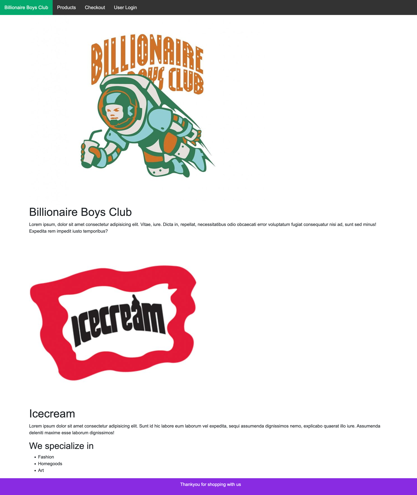
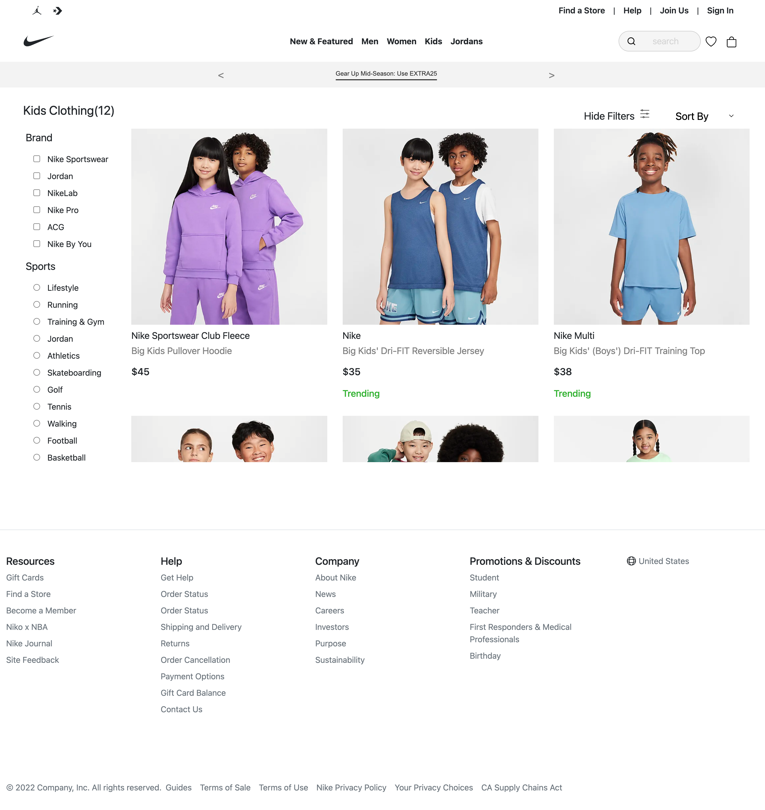
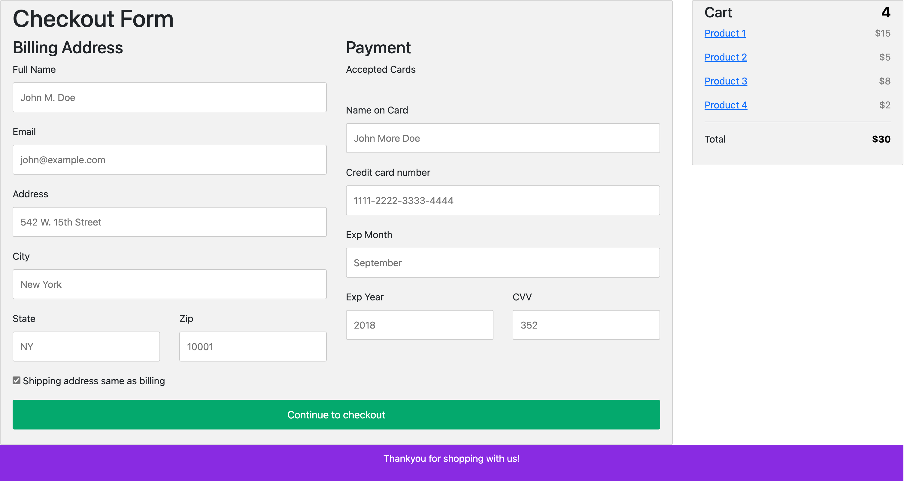
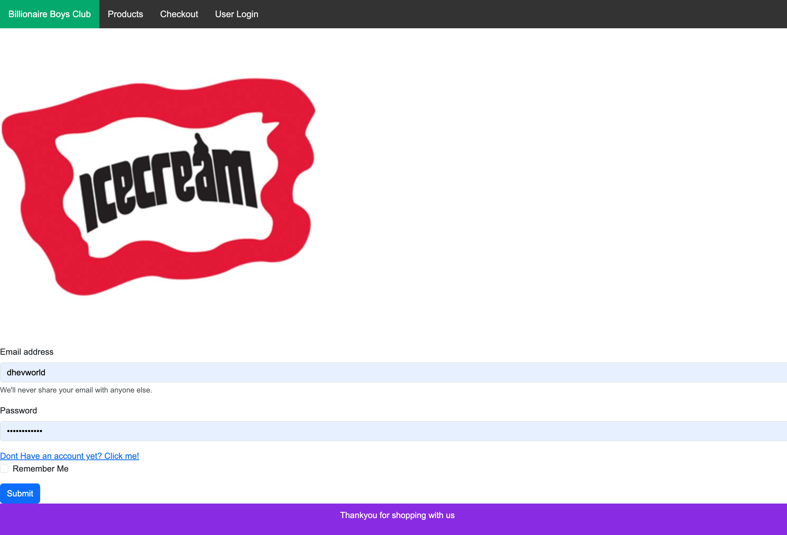
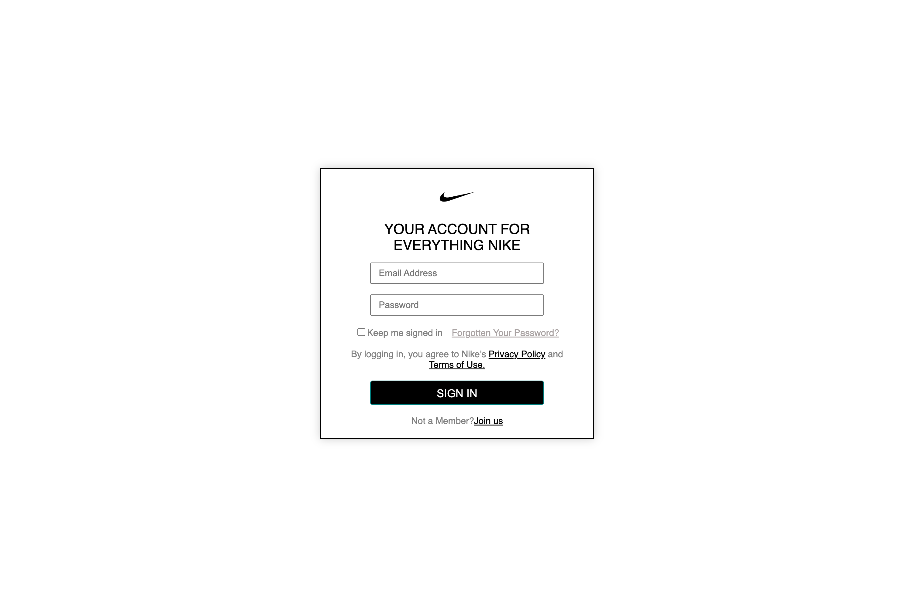
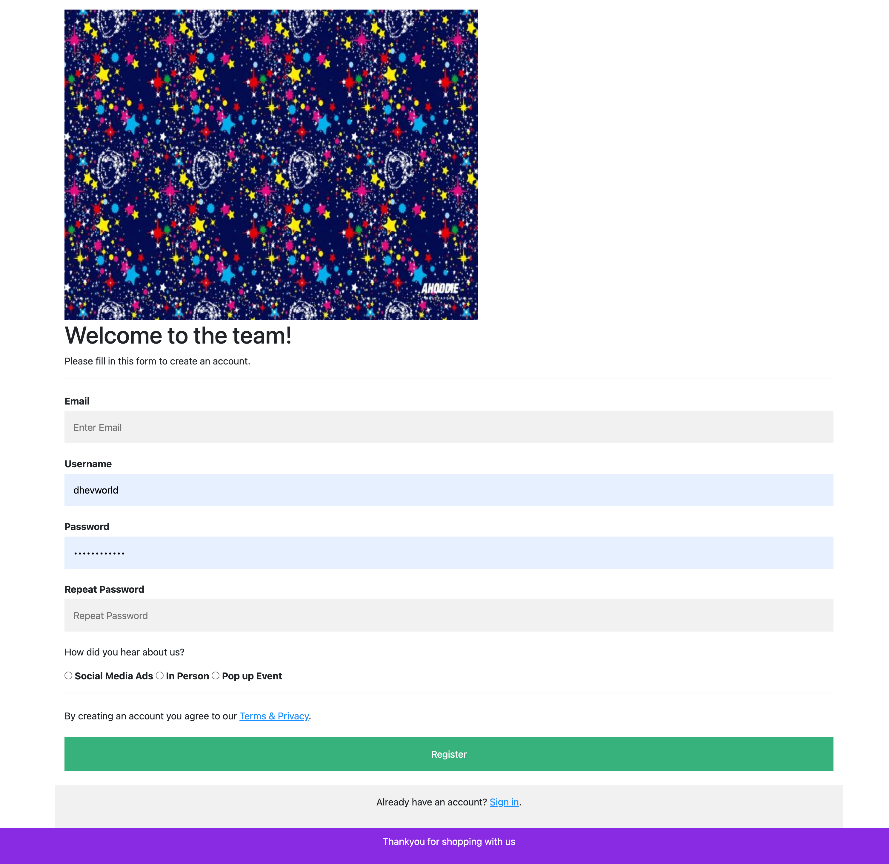
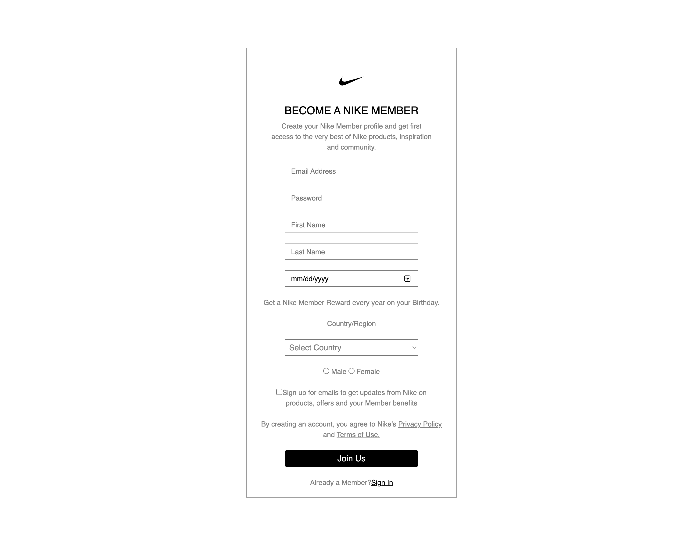
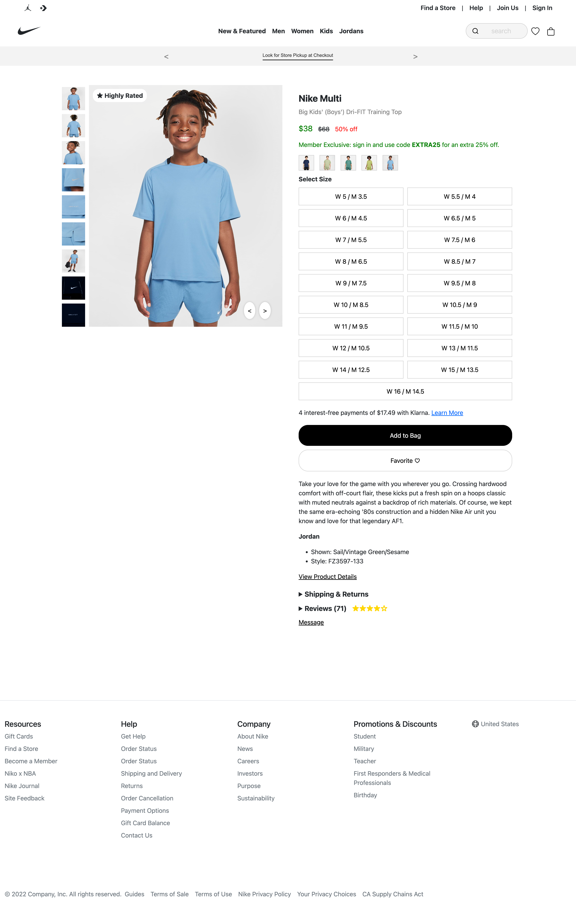
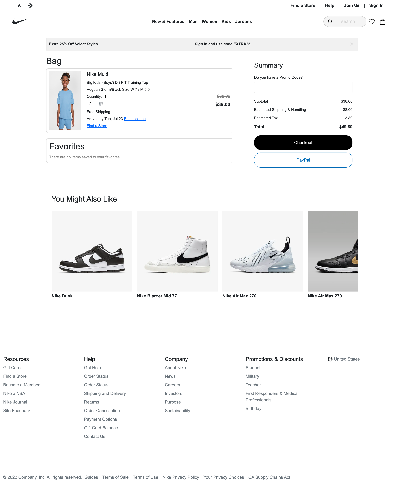

# Hi everyone, Welcome to our Team Project - Nike Clone!

Overview
- This project is a enhance the Denzel's first Capstone. We built this web application usng HTML, CSS, Bootstrap, and JavaScript. We decided to challenge ourseleves by cloning the Nike website and functions as if the user was navigating the actual Nike.com website.

# Team Members
-  Aung Aung: Project Leader 
 ( New & Featured, Size, Cart Pages and Overall Functionality )
- Julien: Project Integrator (Home Page and Code tester)
- Pooja: Project Coordinator (Products and Product Showcase Pages)
- Denzel: Project Initiator (Sign In, Sign Up, and Checkout Pages)

### Requirement for the Capstone 1 Version 2.0
- Page Requirements: Home, Products, Checkout, Sign In, Sign Up Pages

- Validate HTML and CSS: Use W3C HTML & CSS Validator

-  Use Git for Version Control

-  Implement HTML, CSS, and Bootstrap:

- Organize Code Structure: Separate directories for CSS, images, and scripts

# Home page 

## Before

## After

# Products page
## Before 

## After

# Checkout page
## Before 

## After

## Sign In page
## Before

## After

# Sign Up page
## Before

## After

# Choose a size page; newly created page

# Cart page; newly created page

# New & Featured page; newly created page

